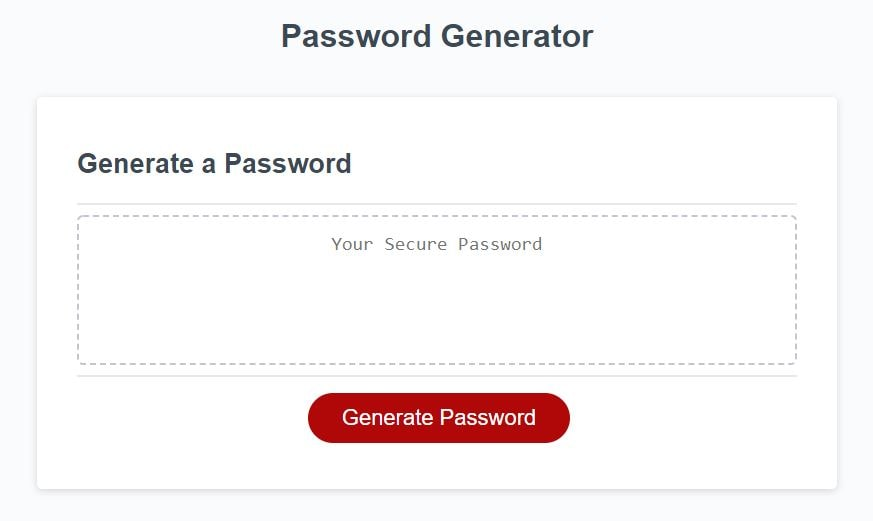
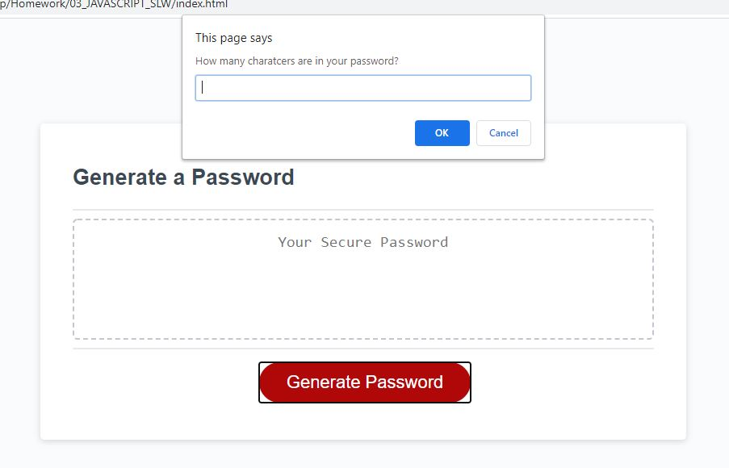
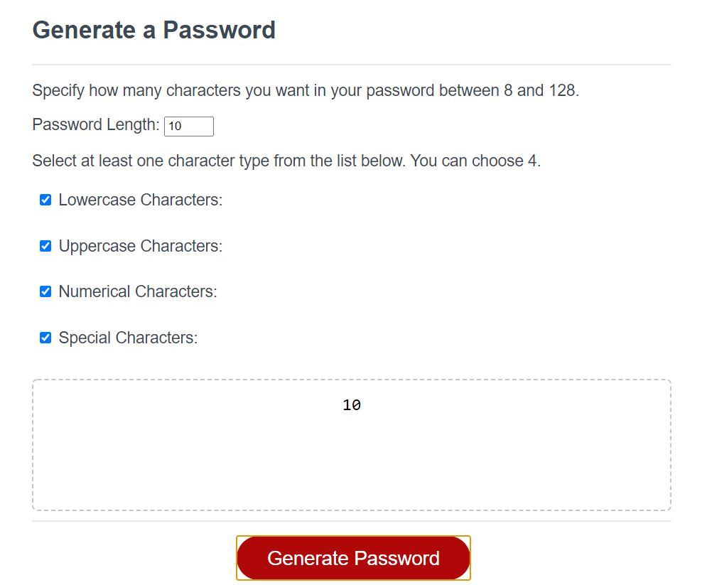
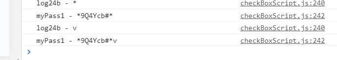

# Sam's Password Generator-s

## Description
This project is an introduction into Javascript functions and programming methods. 

I have built a password generator that will generate you a RANDOM password of your length choice, and character type choice. 
It has been a good way to practise using methods, functions, and using events, and event listeners. It uses all JavaScript core features that I need to be able to use including “strings” [arrays] and {objects}. 

The problem that this project has solved for me is just practising applying the maths. Algebra is not an issue for me but knowing what methods to apply to the algebra is the tough part. Being able to practise these methods will remind me what I can do and what can be done in the future, securing my understanding of the principles. 
My project will hopefully show a number of ways to achieve this generator. My first Priority was to get the generator to work. 

Further explanation of my project will be outlined in usage. 

## Contents 

* Installation 
* Usage
   * index.html and script.js - Basic
* Credits
* License 

I have used:
HTML
JavaScript
CSS styling

## Installation

My project will have a number of .HTML and .JS files depending on my progress through the project.

To get the development to run on the basic method, you need only run the index.html and follow the onscreen alerted instructions generated after you click the button. this will link through to script.js

Further parings are listed below: 

## Usage

My project will have a number of .HTML and .JS. 

My priority was first to get the script working with basic JavaScript before applying more complicated principles. Ironically adding more complex code will make the function run better and more accepted for coding but I wanted to keep things simple from a learning perspective. 

WALK BEFORE I RUN (learning from my responsive portfolio, where I very much ran.) 

You will also find a test.html. This was where I practise ran my function code using console.log to keep an eye on my outcomes and test the code I was writing. I then imported this into the .js file. 

### index.html and script.js - Basic

This is my first creation. 

This front page was provided code by the course creators. As was the CSS. 

I added a series of prompts and confirms to obtain the information from the user, starting with a While loop to ask for a password length between 8 and 128. It alerts the user is they are under or over this andreturns to the prompt if they give an incorrect response. 

I have not however included an "if" on the occurence of a none numerical input by the user. 

This is followed by the use of confirms to assertain the need for various character types. 

#### Difficulties

I made and tested the functionality in a seperate HTML, all fine. 

Once inside the .js file and the event listners had been created, I kept getting undefined in the textarea. This turned out to be that I had not generated a readable output from my for loop, I had just taken the console log as finished. 

I have shown in my test 3 ways of acheiving this, a string, a commar seperated string from an array, and a none seperated string from an array. 

#### Improvements on this.

Having discussed projects with Pawel, I need to look into better use of objects. 

I want to also look at using check boxes for a nicer user interface from the alert system, which also you have to loop through to get out of the interface. 

Pawel also mentioned trying smaller functions rather than my one massive function. 

### Checkbox and CheckboxScript

I have created a password generator that can:
* Detect what your password length is.
* Alert you if you are not within the range of numbers and adjust to the min or max    allowence
* Detect which options you have selected and if you unselect any of these boxes by changing your mind. 

#### DIfficulties

(Update 02.10.2020 - 22.42) - I'm so close with having a check box functioning code. 
the password is sat in the DEVtools under myPass1 

(Update 02.10.2020 - 22.55) - I have descovered there is a general problem if there are any solutions unchecked. I have been testing the function with all checked. I need to possibly put an if else statment in the is checked section. 

I know that i am sending the passlen variable from the genPassLength function. 

I have tried every combination I can think of and changing this action breaks the code.

I am so close to acheiving this. 

## Credits 

Thanks need to go to: Pawel and Andy for helping me trouble shoot, undefined function and capturing my for loop respectivley. 

The resources I have refered to while using this page have been 
W3Schools.com
imagecompressor.com
stackoverflow.com

## License

All images in this project are Copyright 2020 to Samantha Wakelam, or other companies whoes branding is shown and may not be used by anyone without express permission from the owners. 
